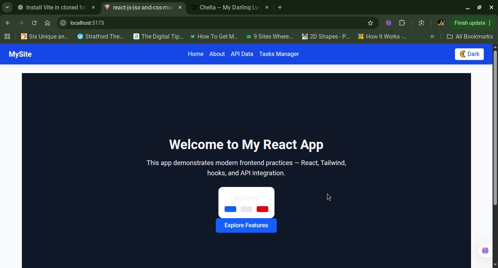
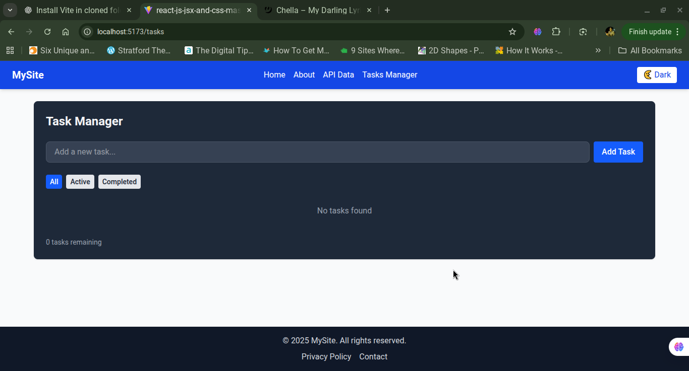

# ⚛️ React + Vite + Tailwind CSS Assignment

## 📖 Overview
This project is a **React.js application** built using **Vite** and **Tailwind CSS**, covering the following major concepts:

- Component architecture and reusability  
- State management and hooks  
- API integration  
- Theming with Tailwind CSS (light/dark mode)  
- Routing with React Router  

The app includes a **Task Manager**, **API Integration Page**, and other reusable UI components like **Navbar**, **Footer**, **Card**, and **Button**.

---

## 🌍 Live Demo
👉 **[View Deployment on GitHub Pages](https://plp-mern-stack-development.github.io/react-js-jsx-and-css-mastering-front-end-development-McAyany/)**  


---

## 🖼️ App Screenshots

<p align="center">
  
  
</p>

<p align="center">
  
  
</p>

---

## 🧱 Task 1: Project Setup

### Steps:
1. Initialize the project using **Vite**:
   ```bash
   npm create vite@latest my-react-app -- --template react
   cd my-react-app
   npm install
    ````
###
2. Install Tailwind CSS:
   ```bash
   npm install tailwindcss @tailwindcss/vite
   ```
3. Create the Tailwind config file:

   ```bash
   npx tailwindcss init -p
   ```
4. Add Tailwind imports to your `index.css`:

   ```css
   @import "tailwindcss";
   ```
5. Start the dev server:

   ```bash
   npm run dev
   ```

---

## 🧩 Task 2: Component Architecture

### Components Created:

* **Button** – Reusable with variants (`primary`, `secondary`, `danger`)
* **Card** – Boxed display container
* **Navbar** – Top navigation with theme toggle
* **Footer** – Persistent footer
* **Layout** – Wraps Navbar, Footer, and main content

Example usage:

```jsx
<Layout>
  <TaskManager />
</Layout>
```

---

## ⚙️ Task 3: State Management and Hooks

### Task Manager Features:

* Add new tasks
* Mark tasks as complete
* Delete tasks
* Filter tasks (All / Active / Completed)

### Hooks Used:

* `useState` → Manage UI and list state
* `useEffect` → Persist data using localStorage
* `useContext` → Handle global theme state
* `useLocalStorage` (custom hook) → Save and retrieve data locally

Example:

```jsx
const [tasks, setTasks] = useLocalStorage("tasks", []);
```

---

## 🌐 Task 4: API Integration

### API Used:

**JSONPlaceholder API** — Provides sample data like posts, comments, and users.

### Features:

* Fetch posts dynamically
* Show loading and error messages
* Implement pagination
* Add a search filter

Example endpoint:

```js
https://jsonplaceholder.typicode.com/posts
```

Example code:

```jsx
useEffect(() => {
  fetch('https://jsonplaceholder.typicode.com/posts')
    .then(res => res.json())
    .then(data => setPosts(data))
    .catch(() => setError(true));
}, []);
```

---

## 🎨 Task 5: Styling with Tailwind CSS

### Objectives:

* Responsive design for mobile, tablet, and desktop
* Dark/light mode support
* Smooth transitions and hover effects
* Utility classes for spacing, layout, and color

Example:

```jsx
<div className="bg-white dark:bg-gray-900 text-gray-900 dark:text-gray-100 min-h-screen flex items-center justify-center transition-all">
  <p className="text-3xl font-bold">
    Current Theme:
    <span className="text-blue-500 dark:text-yellow-400">Dark Mode Test</span>
  </p>
</div>
```

---

## 🧭 Navigation Structure

| Route    | Component      | Description                |
| -------- | -------------- | -------------------------- |
| `/`      | Home           | Landing page               |
| `/about` | About          | App info page              |
| `/tasks` | TaskManager    | Manage tasks               |
| `/api`   | ApiIntegration | Fetch and display API data |

---

## 🧠 Theme Management (Context API)

### `ThemeContext.jsx`

Handles global theme using React Context.

```jsx
const [theme, setTheme] = useState("light");

const toggleTheme = () => {
  setTheme(theme === "light" ? "dark" : "light");
};
```

Wrapped around the root app:

```jsx
<ThemeProvider>
  <App />
</ThemeProvider>
```

---

## 📂 Folder Structure

```
src/
│
├── components/
│   ├── Button.jsx
│   ├── Card.jsx
│   ├── Navbar.jsx
│   ├── Footer.jsx
│   └── Layout.jsx
│
├── context/
│   └── ThemeContext.jsx
│
├── hooks/
│   └── useLocalStorage.jsx
│
├── pages/
│   ├── Home.jsx
│   ├── About.jsx
│   ├── TaskManager.jsx
│   └── ApiIntegration.jsx
│
├── App.jsx
├── index.css
└── main.jsx
```

---

## 🚀 Running the App

1. Install dependencies:

   ```bash
   npm install
   ```
2. Run the dev server:

   ```bash
   npm run dev
   ```
3. Visit in browser:

   ```
   http://localhost:5173
   ```

---

## 💡 Key Concepts Practiced

* React component composition
* State and lifecycle management
* Custom hooks and context
* API data fetching and error handling
* Responsive UI with Tailwind CSS

---

## 🧾 License

This project is licensed under the **MIT License** for educational purposes.

---

## 👨‍💻 Author

**AYANY Obala**
React + Tailwind CSS Project • 2025

---

